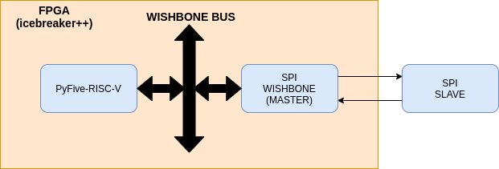

# pyfive-spi (SPI peripheral for Pyfive)

## Ideal implementation:

    

## References:

- Lattice Docs: [link](https://github.com/PyFive-RISC-V/pyfive-spi/docs/SPIWISHBONEController-Documentation.pdf)
- SPI Module by Incore: [Incore](https://chromitem-soc.readthedocs.io/en/0.9.9/spi.html)
- SPI Extension in cocotb: [cocotbext-spi](https://github.com/Martoni/cocotbext-spi)
- What is SPI? Basics for beginners by nandland ([video](https://www.youtube.com/watch?v=ba0SQwjTQfw))
- SPI Master in FPGA by nandland ([video](https://www.youtube.com/watch?v=m1hFeAqQ-H8))

## License:
- More info can be found [here](https://github.com/PyFive-RISC-V/pyfive-spi/blob/main/LICENSE)